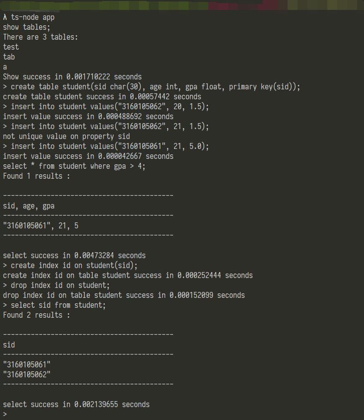
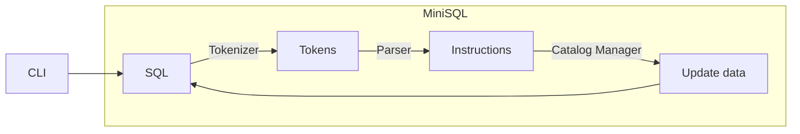

# MiniSQL 实验报告

作者：魏耀东（3160105062）， 朱凇伯（3160103828）


## 项目概览


通过 [TypeScript](http://www.typescriptlang.org/) 实现了一个基于 CLI（Command-Line Interface） 微型数据库。用户可以通过命令行接口来访问这个微型数据库。

在命令行中的运行形式如下：




下面是这个数据库的交互逻辑



其中 `CatalogManager` 负责对所有指令的执行。`CatalogManager` 将保存 `IndexManager` 和 `BufferManager` 的实例，并在相应的指令执行时调用。

支持的 SQL 指令包括：

```sql
select * from xxx;
select a,b from xxx where b <> a and 1=1 or 1=0;
insert into xxx values(2, 2);
delete from xxx;
delete * from xxx where a > b;
create table x(a int, b int unique, c char(10), d float, primary key(d));
create index xx on xxx;
drop index xx on xxx;
drop table xxx;
exec test.sql;
exit;
```


## SQL 前端

由于提供的是命令行接口，所以这里相当于实现的是一个 REPL（Run-Evaluate-Print-Loop）。 node 提供了 `readline` 模块来支持命令行输入。使用方式如下：

```typescript
import * as readline from "readline";

const rl = readline.createInterface({
    input: process.stdin,
    output: process.stdout
});

rl.on("line",
    (code: string) => {
        console.log(code);
    });
```

### Tokenizer

为了简便这里直接使用了 ECMAScript 的正则表达式来对输入进行匹配，然后将所有非字符串字面量的 token 转化为小写方便处理

```typescript
export function tokenizer(code: string): string[] {
    return code.match(/[_a-zA-Z][_a-zA-Z0-9]*|[*=;]|(<>)|[<>(),]|\.|"([^"]*(\\["'])*)*"|'([^"]*(\\["'])*)*'|((-?\d+)(\.\d+)?)|0/g).map(x => x[0] === "\"" ? x : x.toLowerCase());
}
```


### Parser

由于我们支持的是 SQL 很小的一个子集，所以这里各种指令的文法都很简单；稍微复杂一点的是 `select` 等语句的条件，这里给出它们的 bnf 文法

```bnf
<restriction> ::= where <expression> ;
    | ;

<expression> ::= <and-expr> or <expression>
    | <and-expr>

<and-expr> ::= <not-expr> and <and-expr>
    | <not-expr>

<not-expr> ::= not <not-expr> 
    | <factor>

<factor> ::= ( <expression> )
    | <cmp-expr>

<cmp-expr> ::= <value> == <value>
    | <value> <> <value>
    | <value> > <value>
    | <value> < <value>
    | <value> is null
    | <value> is not null

<value> ::= <identifier>
    | <string-literal>
    | <int-literal>
    | <bool-literal>
    | <float-literal>
```

由于支持的指令非常有限，于是对每个指令提供了相应的类型并存放其所需数据

```typescript
export enum InstType {
    CREATE_INDEX,
    CREATE_TABLE,
    SELECT,
    DELETE,
    DROP_TABLE,
    DROP_INDEX,
    INSERT,
    EXIT,
    LOAD,
    SHOW,
    EXECUTE_FILE
}

export class Instruction {
    itype : InstType;
    constructor(type : InstType) {
        this.itype = type;
    }
}

export class Select extends Instruction {
    names: string[];
    tableName: string;
    restriction: AST;

    constructor(names: string[], tableName: string, restriction: AST) {
        super(InstType.SELECT);
        this.names = names;
        this.tableName = tableName;
        this.restriction = restriction;
    }
}

// other instructions leave out
```

`Parser` 拿到由 `Tokenizer` 解析的 token 后进行分析来生成相应的 `Instruction`

下面是 解析 `select` 指令的函数

```typescript
function parseSelect(tokens: string[]): Select {

//     syntax for "select" :  
//    
//     <select-stmt> ::= select <identifiers> from <identifier> <restriction>
//                       | select * from <identifier> <restriction>
//    
//     <identifiers> ::= <identifier> 
//                     | <identifier> , <identifiers>
//    

    let position = 0;
    const max = tokens.length;

    function current(): string {
        if (position < max)
            return tokens[position];
        else
            return null;
    }

    function shift() {
        if (position < max) {
            const temp = tokens[position];
            position++;
            return temp;
        } else {
            return null;
        }
    }

    function match(str? : string): void {
        if (str) {
            if (current() === str) {
                position++;
            } else {
                throw `Parse Error : when parsing <select>, expected token \"${str}\" , actual token \"${
                    current()}\"`;
            }
        } else {
            if (position < max) position++;
        }
    }

    function parseIdentifiers(): string[] {
        const res: string[] = [];
        if (getTokenType(current()) !== TokenType.IDENT) {
            throw `Parse Error : when parsing <identifiers>, expected identifier, got ${current()}`;
        }
        res.push(shift());
        while (current() === ",") {
            match(","); 
            if (getTokenType(current()) !== TokenType.IDENT) {
                throw `Parse Error : when parsing <identifiers>, expected identifier, got ${current()}`;
            }
            res.push(shift());
        }
        return res;
    }

    function parseSelectStmt(): Select {
        let names: string[] = [];
        match("select");
        if (!(current() === "*")) {
            names = parseIdentifiers();
        } else {
            match("*");
        }
        match("from");
        const tableName = shift();
        const restriction = parseRestriction(tokens.slice(position, max));
        return new Select(names, tableName, restriction);
    }

    return parseSelectStmt();
}
```

而对于执行文件的指令 `exec` ，则需要先确认当前进程是否有访问该文件的权限，如果能够正确访问则将文件内容读出来，以 `;` 为分界符把代码分割为数条 `Instruction` 然后依次执行。

## SQL 后端

在前端将代码转化为 `Instruction` 之后，任务就交给了后端的 `CatalogManager` 来进行执行。


## 总结


