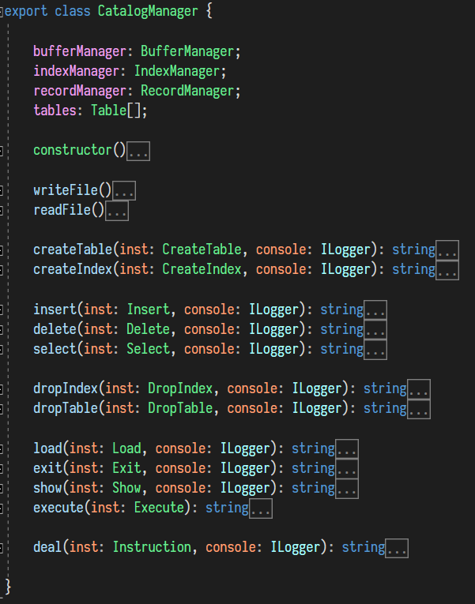

# MiniSQL 实验报告

作者：魏耀东（3160105062）， 朱凇伯（3160103828）

[TOC]

## 项目概览

通过 [TypeScript](http://www.typescriptlang.org/) 实现了一个基于 CLI（Command-Line Interface） 微型数据库。用户可以通过命令行接口来访问这个微型数据库。

在命令行中的运行形式如下：


下面是这个数据库的交互逻辑


其中 `CatalogManager` 负责对所有指令的执行。`CatalogManager` 将保存 `IndexManager` 和 `BufferManager` 的实例，并在相应的指令执行时调用。

支持的 SQL 指令包括：

```sql
select * from xxx;
select a,b from xxx where b <> a and 1=1 or 1=0;
insert into xxx values(2, 2);
delete from xxx;
delete * from xxx where a > b;
create table x(a int, b int unique, c char(10), d float, primary key(d));
create index xx on xxx;
drop index xx on xxx;
drop table xxx;
exec test.sql;
exit;
```


## SQL 前端

由于提供的是命令行接口，所以这里相当于实现的是一个 REPL（Run-Evaluate-Print-Loop）。 node 提供了 `readline` 模块来支持命令行输入。使用方式如下：

```typescript
import * as readline from "readline";

const rl = readline.createInterface({
    input: process.stdin,
    output: process.stdout
});

rl.on("line",
    (code: string) => {
        console.log(code);
    });
```

### Tokenizer

为了简便这里直接使用了 ECMAScript 的正则表达式来对输入进行匹配，然后将所有非字符串字面量的 token 转化为小写方便处理

```typescript
export function tokenizer(code: string): string[] {
    return code.match(/[_a-zA-Z][_a-zA-Z0-9]*|[*=;]|(<>)|[<>(),]|\.|"([^"]*(\\["'])*)*"|'([^"]*(\\["'])*)*'|((-?\d+)(\.\d+)?)|0/g).map(x => x[0] === "\"" ? x : x.toLowerCase());
}
```


### Parser

由于我们支持的是 SQL 很小的一个子集，所以这里各种指令的文法都很简单；稍微复杂一点的是 `select` 等语句的条件，这里给出它们的 bnf 文法

```bnf
<restriction> ::= where <expression> ;
    | ;

<expression> ::= <and-expr> or <expression>
    | <and-expr>

<and-expr> ::= <not-expr> and <and-expr>
    | <not-expr>

<not-expr> ::= not <not-expr> 
    | <factor>

<factor> ::= ( <expression> )
    | <cmp-expr>

<cmp-expr> ::= <value> == <value>
    | <value> <> <value>
    | <value> > <value>
    | <value> < <value>
    | <value> is null
    | <value> is not null

<value> ::= <identifier>
    | <string-literal>
    | <int-literal>
    | <bool-literal>
    | <float-literal>
```

由于支持的指令非常有限，于是对每个指令提供了相应的类型并存放其所需数据

```typescript
export enum InstType {
    CREATE_INDEX,
    CREATE_TABLE,
    SELECT,
    DELETE,
    DROP_TABLE,
    DROP_INDEX,
    INSERT,
    EXIT,
    LOAD,
    SHOW,
    EXECUTE_FILE
}

export class Instruction {
    itype : InstType;
    constructor(type : InstType) {
        this.itype = type;
    }
}

export class Select extends Instruction {
    names: string[];
    tableName: string;
    restriction: AST;

    constructor(names: string[], tableName: string, restriction: AST) {
        super(InstType.SELECT);
        this.names = names;
        this.tableName = tableName;
        this.restriction = restriction;
    }
}

// other instructions leave out
```

`Parser` 拿到由 `Tokenizer` 解析的 token 后进行分析来生成相应的 `Instruction`

下面是 解析 `select` 指令的函数

```typescript
function parseSelect(tokens: string[]): Select {

//     syntax for "select" :  
//    
//     <select-stmt> ::= select <identifiers> from <identifier> <restriction>
//                       | select * from <identifier> <restriction>
//    
//     <identifiers> ::= <identifier> 
//                     | <identifier> , <identifiers>
//    

    let position = 0;
    const max = tokens.length;

    function current(): string {
        if (position < max)
            return tokens[position];
        else
            return null;
    }

    function shift() {
        if (position < max) {
            const temp = tokens[position];
            position++;
            return temp;
        } else {
            return null;
        }
    }

    function match(str? : string): void {
        if (str) {
            if (current() === str) {
                position++;
            } else {
                throw `Parse Error : when parsing <select>, expected token \"${str}\" , actual token \"${
                    current()}\"`;
            }
        } else {
            if (position < max) position++;
        }
    }

    function parseIdentifiers(): string[] {
        const res: string[] = [];
        if (getTokenType(current()) !== TokenType.IDENT) {
            throw `Parse Error : when parsing <identifiers>, expected identifier, got ${current()}`;
        }
        res.push(shift());
        while (current() === ",") {
            match(","); 
            if (getTokenType(current()) !== TokenType.IDENT) {
                throw `Parse Error : when parsing <identifiers>, expected identifier, got ${current()}`;
            }
            res.push(shift());
        }
        return res;
    }

    function parseSelectStmt(): Select {
        let names: string[] = [];
        match("select");
        if (!(current() === "*")) {
            names = parseIdentifiers();
        } else {
            match("*");
        }
        match("from");
        const tableName = shift();
        const restriction = parseRestriction(tokens.slice(position, max));
        return new Select(names, tableName, restriction);
    }

    return parseSelectStmt();
}
```

而对于执行文件的指令 `exec` ，则需要先确认当前进程是否有访问该文件的权限，如果能够正确访问则将文件内容读出来，以 `;` 为分界符把代码分割为数条 `Instruction` 然后依次执行。

## SQL 后端

### Catalog Manager

在前端将代码转化为 `Instruction` 之后，任务就交给了后端的 `CatalogManager` 来进行执行。

`CatalogManager` 用来统筹前后端之间所有的数据交互并将任务交由其它的 `Manager` 进行执行。它的接口定义如下



在构造时，`CatalogManager` 将先读取存在磁盘中的关于数据库表和索引的元数据（metadata）。由于使用的语言是 TypeScript ，所以我们可以直接使用 `JSON.stringify` 和 `JSON.parse` 来实现这些信息的序列化与反序列化。 

所以这里我们先对 SQL 本身的类型系统和 Table 本身进行描述：

基础类型包括

```typescript
export enum BasicType {
    INT,
    FLOAT,
    CHARS
}
```

这里使用一个 `Interface` 来描述所有的  SQL 类型

```typescript
export interface IType {
    btype: BasicType;
    getSize(): number;
    toString(): string;
}
```

这里只实现了三种类型，所以用三个类实现这个接口

```typescript
export class IntType implements IType{
    btype = BasicType.INT;
    getSize() {
        return 4;
    }
    toString() {
        return "int";
    }
}

export class FloatType implements IType {
    btype = BasicType.FLOAT;
    getSize() {
        return 8;
    }
    toString() {
        return "float";
    }
}

export class CharsType implements IType {
    btype = BasicType.CHARS;
    count: number;

    getSize() {
        return this.count;
    }

    constructor(count: number) {
        this.btype = BasicType.CHARS;
        this.count = count;
    }
    toString() {
        return `char(${this.count})`;
    }
}
```

对于表中的每一个成员，使用了 `TableMember` 这个类来记录它们的信息，并使用 `TableHeader` 来记录一个 `Table` 本身的信息

```typescript
export class TableMember {
    index: string;
    type: IType;
    unique: boolean;
}

export class TableHeader {
    name: string;
    members: TableMember[];
    primary: string;
}
```

所以在写入 metadata 的时候可以直接使用 `JSON.stringify` ：

```typescript
writeFileSync(TABLE_METADATA_PATH, JSON.stringify({
    tables: this.tables.map(x => {
        return { header: x.header, indices: x.indices, freeHead: x.freeHead };
    })
}, null, 2));
```

在空数据库执行以下语句后会创建如下 JSON 文件：

```sql
create table test(a int unique, b float, primary key(a));
```

```json
{
    "tables": [
        {
            "header": {
                "name": "test",
                "members": [
                    {
                        "index": "a",
                        "type": {
                            "btype": 0
                        },
                        "unique": true
                    },
                    {
                        "index": "b",
                        "type": {
                            "btype": 1
                        },
                        "unique": false
                    }
                ],
                "primary": "a"
            }
        }
    ]
}
```

### Index Manager

`indexManager` 用来管理数据库表的索引，这里使用的是B+ 树。

首先约定 B+ 树的节点公用接口：

```typescript
export interface BNode<T, BKeyType> {
    keys: Array<BKeyType>;
    keyNum: number;
    isLeaf: boolean;
    getNum(): number;
    setNum(n: number);
    getKey(i: number): BKeyType;
    setKey(i: number, key: BKeyType);

    getIndex(key: BKeyType): number;

    removeKey(index: number, cindex: number);
    split(parent: BNode<T, BKeyType>, cindex: number);
    merge(parent: BNode<T, BKeyType>, child: BNode<T, BKeyType>, index: number);
    clear();

    // left : true, right : false
    moveFrom(neighbour: BNode<T, BKeyType>, parent: BNode<T, BKeyType>, index: number, dir: Direction);
    getCIndex(key: BKeyType, index: number): number;
}
```

考虑到每个 Block 的大小为 4k ，所以在构造 B+ 树的节点时需要根据节点的 key 和 value 的类型算出每个 B+ 树节点的最大大小，作为参数传入其构造函数中。B+ 树的节点的键根据其索引的类型而定，值则对应 `BufferManager` 中的一个 Block 。根据这个 Block 的头来确定这是 B+ 树节点或者是 Record 数据。 B+ 树的插入和删除是一个镜像的过程，这里提供非叶子节点的删除代码：

```typescript
removeNode(current: BNode<T, TBKeyType>, key: TBKeyType) {
    if (!current) return;
    while (true) {
        let index = current.getIndex(key);
        let cindex = current.getCIndex(key, index);
        if (current.isLeaf) {
            if (key === this.maxKey && index > 0) {
                this.maxKey = current.getKey(index - 1);
            }
            current.removeKey(index, cindex);
            if (cindex === 0 && !this.root.isLeaf && current !== this.headNode) {
                this.changeKey(this.root, key, current.getKey(0));
            }
            return;
        } else {
            let child = (<BInterNode<T, TBKeyType>>current).getChild(cindex);
            if (child.getNum() == B_NODE_MIN_SIZE) {
                let left: BNode<T, TBKeyType> =
                    cindex > 0 ? (<BInterNode<T, TBKeyType>>current).getChild(cindex - 1) : null;
                let right: BNode<T, TBKeyType> = cindex < current.getNum()
                ? (<BInterNode<T, TBKeyType>>current).getChild(cindex + 1)
                : null;
                if (left !== null && left.getNum() > B_NODE_MIN_SIZE) {
                    child.moveFrom(left, current, index - 1, LEFT_DIR);
                } else if (right !== null && right.getNum() > B_NODE_MIN_SIZE) {
                    child.moveFrom(right, current, cindex, RIGHT_DIR);
                } else if (left !== null) {
                    left.merge(current, child, cindex - 1);
                    child = left;
                } else if (right !== null) {
                    right.merge(current, child, cindex);
                    child = right;
                }
            }
            current = child;
        }
    }
}
```

然后是 Index Manager 本身需要提供的接口

```typescript
interface IIndexManager {
    createIndex(index: Index, table: Table);
    dropIndex(indexName: string, table: Table);
    getIndex(indexName: string, table: Table);
    closeIndex(indexName: string, table: Table);
}
```

其提供的主要方法包括建立/删除一个索引，将一个索引从 buffer 中读取、将一个索引写入 buffer

通过 `indexManager` 拿到的 `Index` 中保留了其 B+ 树的引用。通过 B+ 树来得到相应查询条件结果的迭代器，来在很短的时间内获取用户想要的结果。

### Record Manager

`recordMananger` 是基于 Buffer Manager 来管理所有表的数据的实例。在我们实现的微型数据库中，仅支持定长的记录。所以我们会根据记录的大小，计算出每个内存块中能保存的最大的记录数量，然后将记录保存在里面。

对于 Record 的删除，我们采取的是课本上的 freeList 方法。每个 Record Block 头部会保存一个 freeListHead 。在删除的时候会将原有的 freeListHead 存入被删除的 record ，然后将这个 record 所在的位置作为 Record 的新 freeListHead。 同时，在插入一条索引时，也可以通过类似的方法还原原来的 freeListHead 。

它的主要接口如下：

```typescript
interface IRecordManager {
    getRecord(rid: number, table: Table): Record;
    insertRecord(Record: data): number;
    deleteRecord(rid: number): Record;
    createFile(filename: string): FileHandle;
    closeFile(filename: string);
}
```

Catalog Manager 在处理 Insert 和 Delete 指令时会对 Record 进行修改，在 Select 时会根据 Index Manager 的结果来返回相应的 Record。

### Buffer Manager

Buffer Manager 是上述模块的基础。所有关于 Record 和 Index 的操作都是基于 Buffer Manager 提供的 Block 的访问读写之上的。 由于现代计算机内存宽裕，这里我们设置存放的最大 Block 数量为 1w ，大概 40 MB 的空间。

Buffer Manager 中实现了脏页与 Pin 、以及 LRU 功能。~大概~ 

对于 脏页 和 Pin 功能，只需要在 Block 中保存这两个信息，并在对其进行修改/读/写时对相应的属性进行查询/修改即可，这里也不加赘述。

LRU 我们直接使用了 ECMAScript 中自带的数组方法：`splice` ，对于最近访问的节点，直接将其放在列表的最前面。当 Block 的数量超过上限时，会从 LRU 列表从后往前搜索，直到出现没有被 Pin 的 Block ，如果发现其已经被修改（dirty），就将其写入内存。

下面是其提供的部分接口

```typescript
interface IBufferMananger {
    createFile(filename: string);
    destroyFile(filename: string);
    openFile(filename: string): IFileHandle;
    closeFile(filename: string);
}

interface IFileHandle {
    getFirstBlock(): Block;
    getLastBlock(): Block;
    getNextBlock(blockId: number): Block;
    getPrevBlock(blockId: number): Block;
    pinBlock();
    unpinBlock();
    setDirty();
    isDirty(): bool;
}
```

## 交互优化

为了使数据库运行效率得到一个直观的显示，对于所有我们支持的指令， 我们使用了 `process` 的 `hrtime()` 方法来获取 CPU 的准确时间，并反馈给用户。

这里我们实现了一个 `Controller` 类来完成所有的交互逻辑

```typescript
class Controller {
    catalog: Catalog;
    constructor() {
        this.catalog = new Catalog();
    }
    deal(inst: Instruction): string {
        if (!inst) return "illegal statement";
        let t = process.hrtime();
        try {
            let res = this.catalog.deal(inst, console);
            let t2 = process.hrtime();
            let time = (t2[0] - t[0]) + (t2[1] - t[1]) / 1e9;
            return `${res} in ${time} seconds`;
        } catch (xxx) {
            return xxx;
        }
    }
}
```

## 总结

这次的微型数据库大作业 

